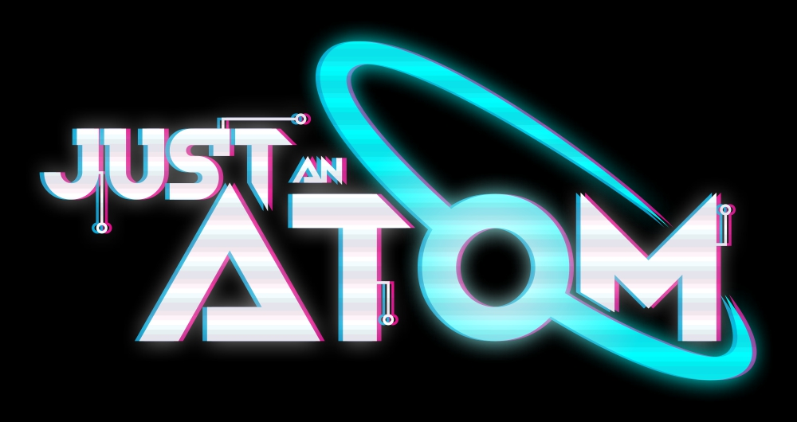

> Наше решение состоит из двух репозиториев. Сначала отдельно нужно собрать UI, который, впоследствии положить в ai/backend и запустить.

> ❗️Не переживайте. Процесс сборки и запуска совсем не сложный и подробно описан в каждом репозитории.

- 🖥️ Находится в [ui/README.md](ui/README.md)
- 🤖 Основная документация по AI / backend находится в [репозитории](https://github.com/xpatronum/jaiai) (🤖 AI).

---

### Контакты

- Telegram: [@itarlinskiy](https://t.me/itarlinskiy)
- Email: [itarlinskiy@yandex.ru](mailto:itarlinskiy@yandex.ru)
